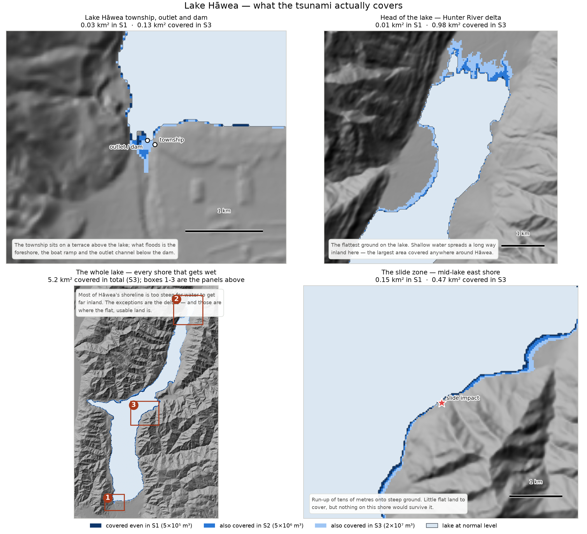
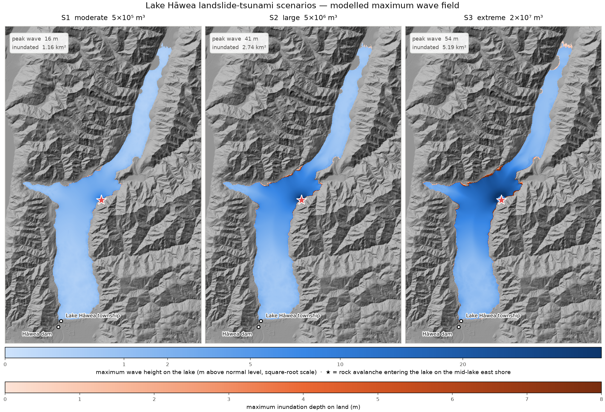
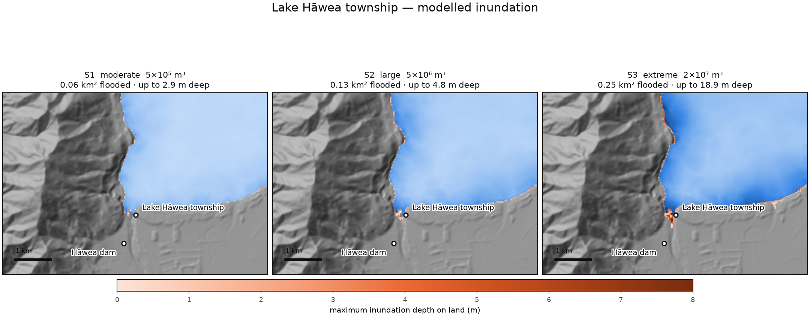
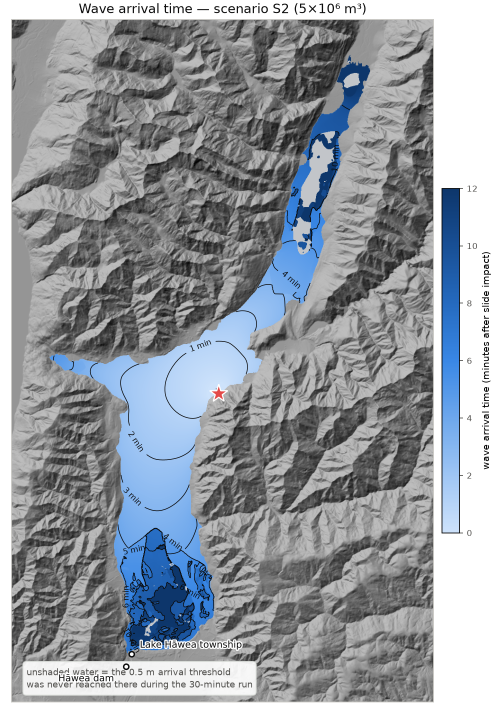
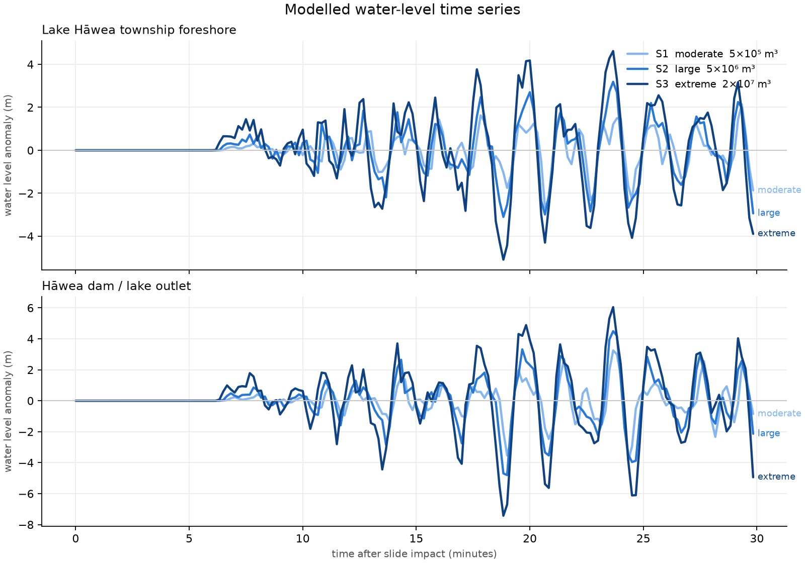
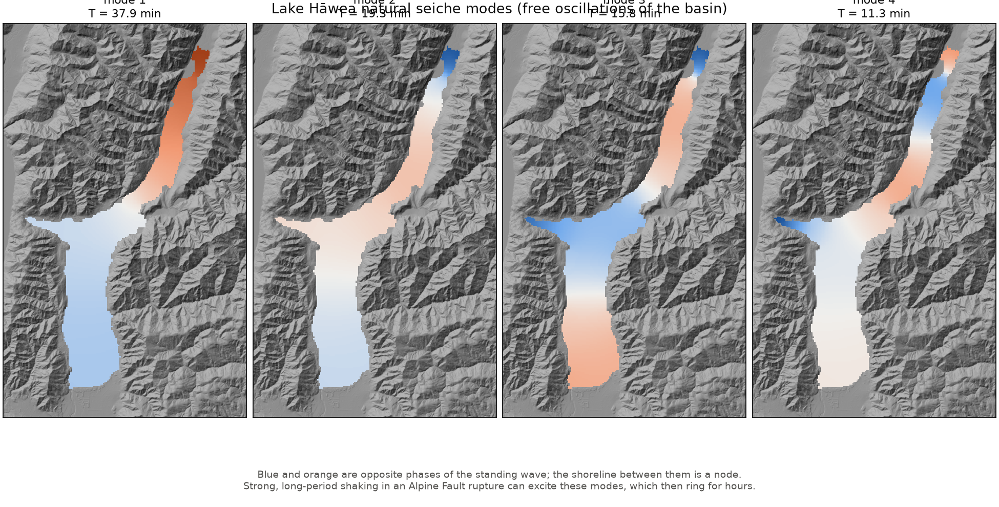
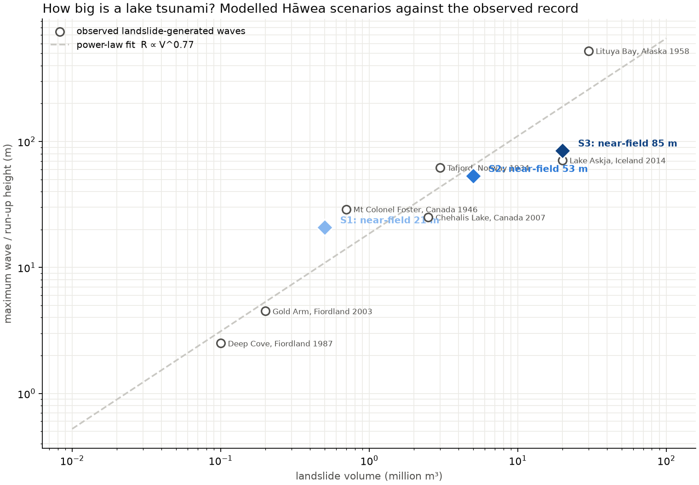
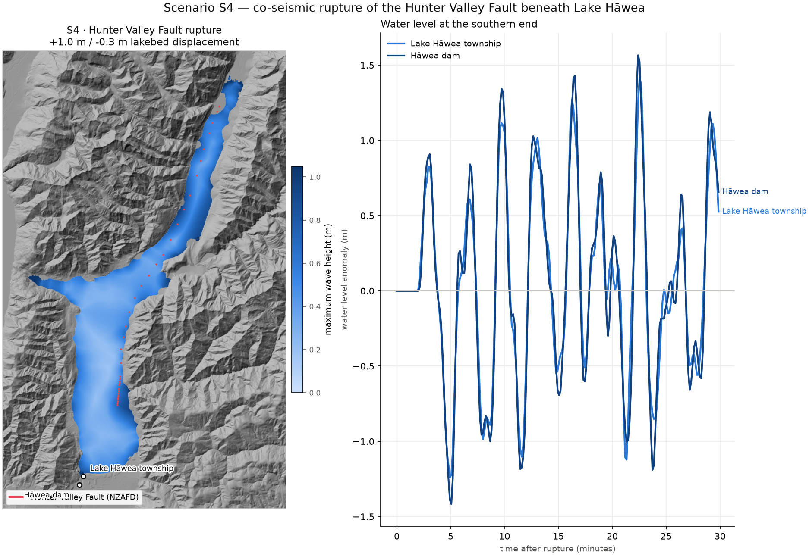

# Lake Hāwea tsunami scenarios

Quantitative scoping study of **landslide- and fault-generated waves on Lake Hāwea,
New Zealand**, for an Alpine Fault rupture. Built end to end from open data: it
downloads a DEM, reconstructs the lake basin, screens the shoreline for landslide
source areas, sizes the wave with the standard impulse-wave equations, propagates it
with a shallow-water model, and produces inundation maps and an animation.

> **Status: research-grade scoping study, not a regulatory hazard map.** It is built
> from a 30 m global DEM and a *reconstructed* bathymetry, because no public
> bathymetric survey of Lake Hāwea exists. See [Limitations](#limitations) before
> using any number here for planning. Its purpose is to show what the hazard plausibly
> looks like and to make the case that a properly surveyed study is worth commissioning.

---

## 1. Does a hazard map already exist for Hāwea, Wānaka or Queenstown?

**No — not a published inundation map, for any of the three.** The hazard is named in
official documents, and the groundwork has been laid, but the modelling is not public.

| Lake | What exists | What does not |
|---|---|---|
| **Hāwea** | The [AF8 Hazard Scenario](https://af8.org.nz/media/yuoignpy/af8_hazardscenario-oct16-final.pdf) (p. 24) names it directly: *"the Hunter Valley Fault under Lake Hawea, and a tsunami there would likely impact Lake Hawea township and possibly the hydro control dam"*. The Hunter Valley Fault is in the GNS Active Faults Database as an uncertain reverse fault crossing the lake. | No bathymetric survey, no wave modelling, no inundation map. |
| **Wānaka** | GNS identified a probable active fault under the lake (2019); ORC commissioned NIWA, which surveyed the lakebed in 2019–21 and [mapped the whole lake in detail](https://niwa.co.nz/news/lake-wanaka-mapped-exquisite-detail). A tsunami scenario was flagged as the next step. | No published inundation modelling or map. |
| **Wakatipu** | Tonkin & Taylor's [Head of Lake Wakatipu Natural Hazards Assessment](https://www.orc.govt.nz/media/9784/head-of-lake-wakatipu-natural-hazards-assessment.pdf) (2021) discusses delta-collapse tsunami, landslide tsunami and seiche — but states plainly that *"the likelihood or possible extent of this has not been investigated or assessed in detail"*. Ruddenklau & Davies (2000) wrote *Impulse Wave Hazard in Lake Wakatipu due to Landslides caused by an Alpine Fault Earthquake* — an unpublished consultancy report. | No public inundation map. |
| **Region-wide** | ORC's [Otago Natural Hazards Exposure Analysis](https://www.orc.govt.nz/media/iksemkon/otago-region-natural-hazards-exposure-analysis-final-report-26-may-2025.pdf) (May 2025) covers nine hazard types. | Lake tsunami and seiche are **not** among them. |

The one New Zealand lake with published modelling is **Tekapo**. A NIWA–GNS–Otago–ECan
study mapped the lakebed, found repeated landslide deposits, and modelled waves that
[*"could exceed 5 m at many locations around the lake shoreline"*](https://niwa.co.nz/news/lake-tekapo-study-raises-awareness-tsunamis-nz-lakes).
The researchers explicitly named Wakatipu, Wānaka and Taupō as lakes that should get
the same treatment. Hāwea was not on that list, although AF8 puts it on its own.

So this repository appears to be the first quantitative inundation estimate for Lake
Hāwea. That is a statement about the gap in the public record, not a claim to replace
a proper study.

---

## 2. How big is a lake tsunami, typically?

Lake tsunamis are *not* small. They are generated close to shore, in confined water,
so there is no deep-ocean spreading to bleed energy away, and near-field run-up is
routinely tens of metres. What makes them survivable-or-not is **volume of the slide**
and **distance from it**.

### Observed events

| Event | Year | Slide volume | Max wave / run-up |
|---|---|---|---|
| Deep Cove, Fiordland 🇳🇿 | 1987 | 0.1 M m³ | **2.5 m** |
| Gold Arm, Charles Sound 🇳🇿 | 2003 | 0.2 M m³ | **4.5 m** |
| Mt Colonel Foster, Canada | 1946 | 0.7 M m³ | **29 m** |
| Chehalis Lake, Canada | 2007 | 2.5 M m³ | **25 m** |
| Tafjord, Norway | 1934 | 3 M m³ | **62 m** |
| Lake Askja, Iceland | 2014 | 20 M m³ | **71 m** |
| Lituya Bay, Alaska | 1958 | 30 M m³ | **524 m** |

(Compiled by GNS Science — Hancox 2012, Table 1 — plus Askja from Gylfadóttir et al. 2017.)

### The rule of thumb GNS uses

From the same study, for earthquake-triggered failures into New Zealand glacial lakes:

- **10³–10⁴ m³** (small debris slides, rock falls) → run-up **0.5–1 m** within 1 km of the slide.
- **10⁵–10⁶ m³** (large bedrock failures) → run-up **~3–25 m**, still significant ~8 km away.
- **>10⁶ m³** → tens of metres near field.

AF8 puts the practical threshold at **>1000 m³** for a hazardous wave.

### So what should you expect at a township?

Near field (first ~1 km) is the extreme end — tens of metres. What matters for a
settlement several kilometres from the likely source areas is the **decayed far-field
wave**, which for a credible Alpine Fault–triggered failure lands in the
**~1–10 m** band. That is consistent with Lake Tekapo's modelled ">5 m at many
locations", and it is what this model produces for Lake Hāwea township
(see [Results](#5-results)).

**A 2–5 m wave arriving at a lakefront with a few minutes' warning is a
life-safety emergency, not a curiosity.** The Hāwea township foreshore, campground,
boat ramp and the lakefront residential strip are all within that band.

---

## 3. What variables do you need?

This is the practical core of the question. Three groups:

### A. Source — the landslide

| Variable | Symbol | Why it matters | Source here |
|---|---|---|---|
| Slide volume | 𝒱 | First-order control on wave size | Scenario (10⁵–10⁷ m³, from GNS size classes) |
| Slide width | b | Sets how much of the wave front is driven | Scenario, tied to the mapped source zone |
| Slide thickness | s | Enters as relative thickness *S = s/h* | Scenario |
| Impact velocity | V_s | The dominant term (Froude number) | Energy balance over the drop height |
| Drop height of centre of mass | Δz | Sets V_s | DEM relief above the source zone |
| Slope / impact angle | α | Controls momentum transfer into the water | DEM slope (38.5° at the ranked zone) |
| Bulk slide density | ρ_s | Enters relative slide mass *M* | 1700 kg/m³ (rock at ~37% porosity) |
| Basal friction angle | δ | Retards the slide | 22–25° (rock avalanche range) |

### B. Receiving basin

| Variable | Symbol | Why it matters | Source here |
|---|---|---|---|
| Still-water depth at impact | h | **The single most sensitive input** | Reconstructed bathymetry |
| Full bathymetry | h(x,y) | Controls celerity, refraction, shoaling | Reconstructed — *no survey exists* |
| Shoreline topography | z_b(x,y) | Controls run-up and inundation extent | Copernicus GLO-30 DEM |
| Shore slope | β | Run-up scales with it | DEM |
| Lake level | — | Hāwea is dam-controlled over an 8 m range | 345 m a.s.l. (DEM-observed) |
| Bed roughness | n | Damping and overland flow resistance | Manning 0.025 |

### C. Trigger and setting

| Variable | Why it matters | Source here |
|---|---|---|
| Earthquake magnitude & shaking intensity | Sets how many slopes fail and how big | AF8: Mw 8.2, MMI 4–10 South Island–wide |
| Distance from the fault | Controls shaking at the lake | ~55 km (head of lake) to ~80 km (township) |
| Slope susceptibility | Where failures can start | DEM screening: slope ≥30°, relief ≥400 m |
| Mapped active faults under the lake | Second, independent tsunami source | GNS NZ Active Faults Database (live query) |
| Basin seiche modes | The lake keeps ringing after the first wave | Computed eigenmodes |
| Exposure at the shore | Turns hazard into risk | Lake Hāwea township, ~2,500 people and growing fast |

### The dimensionless combination that actually predicts the wave

Everything in group A collapses into Heller & Hager's **impulse product parameter**:

```
P = F · S^½ · M^¼ · [cos(6α/7)]^½

  F = V_s / √(g h)            slide Froude number
  S = s / h                   relative slide thickness
  M = ρ_s 𝒱 / (ρ_w b h²)      relative slide mass
```

and then the near-field wave is just

```
H_M = (5/9) · P^0.8 · h        maximum wave height
x_M = (11/2) · P^0.5 · h       where it occurs
T_M = 9 · P^0.5 · √(h/g)       its period
```

If you take one thing away: **P is the number to compute.** The implementation is in
[`src/impulse_wave.py`](src/impulse_wave.py) and it reproduces the worked Lake Askja
example from the VAW-211 manual to within 1%.

---

## 4. How it was modelled

**Source sizing** — Heller, Hager & Minor (2009/2019) VAW-211 impulse-wave equations, validated against the manual's own Lake Askja worked example.

**Propagation and inundation** — a 2D nonlinear shallow-water model on a 30 m NZTM2000 grid (staggered C-grid, upwind face depths, nonlinear advection, Manning friction, wetting and drying), verified against the analytic long-wave celerity. The empirical relations size the source only; real basin geometry does the rest, which is the right call for a lake whose shape is neither the idealised 2D channel nor the 3D open basin of the experiments.

**Lake reconstruction** — mask and bathymetry from the DEM's flattened water surface at 345 m a.s.l.: 150.4 km² (published ~141 km²), max depth 392 m, mean 161 m, volume 24.1 km³.

### Where the landslides would come from

Screening the whole 137 km shoreline for slopes ≥30° with ≥400 m of relief within 1.5 km inland leaves **four candidate source zones**, about 7% of the shoreline:

| Zone | Position | Shore length | Mean slope | Relief | Distance to township |
|---|---|---|---|---|---|
| 4 | mid-lake, east shore (-44.465°S, 169.330°E) | 3.9 km | 38° | 1125 m | 17 km |
| 1 | head of lake (Hunter arm) (-44.319°S, 169.413°E) | 1.9 km | 32° | 960 m | 35 km |
| 3 | mid-lake, west shore (-44.451°S, 169.223°E) | 1.9 km | 32° | 966 m | 18 km |
| 2 | north-east shore (-44.427°S, 169.374°E) | 0.7 km | 32° | 432 m | 23 km |

Scenarios S1–S3 all place the slide in **zone 4**, the highest-ranked (38.5° mean slope, 1125 m of relief, 17 km up-lake from the township).

## 5. Results

### Landslide scenarios

| | Volume | P | Near-field H_M | Peak on lake | At township | First arrival | Largest wave at | At dam | Dam overtops | Land flooded |
|---|---|---|---|---|---|---|---|---|---|---|
| **S1** moderate | 5×10⁵ m³ | 0.59 | 21 m | 16 m | **2.1 m** | 11 min | 29 min | 3.2 m | no | 1.16 km² |
| **S2** large | 5×10⁶ m³ | 1.91 | 53 m | 41 m | **3.2 m** | 7 min | 24 min | 4.5 m | **+0.13 m** | 2.74 km² |
| **S3** extreme | 2×10⁷ m³ | 2.52 | 85 m | 54 m | **4.6 m** | 7 min | 24 min | 6.0 m | **+2.22 m** | 5.19 km² |

Two results matter more than the headline heights.

**The first wave is not the biggest.** At the township the leading wave arrives in 7–11 minutes at only 1–1.5 m, and the level then oscillates with *growing* amplitude, peaking 24–29 minutes after the slide. This is energy being redistributed into the southern basin, not numerical instability: lake-wide wave energy decays monotonically to about a quarter of its initial value over the same period, and the largest amplitude anywhere is at t = 0. For evacuation planning this inverts the usual instinct — the shore is *more* dangerous twenty minutes in than at first arrival.

**The dam overtops in the larger scenarios.** With the assumed 348.0 m crest (3 m of freeboard), **S2** large and **S3** extreme overtop, by 0.13 m and 2.22 m. This is exactly the concern AF8 raises for Lake Hāwea. **It depends entirely on the assumed crest elevation**, which is not public — the real figure from the dam owner could move this result either way, and it is the single cheapest input that would sharpen this study.

### Fault scenario

**S4 — Hunter Valley Fault**, the source AF8 names for this lake. Mapped trace from NZAFD, strike +23°, rupture span 43 km, lakebed displacement +1.0 m (hanging wall) to -0.3 m (footwall).

- Peak wave on the lake: **1.6 m**
- Lake Hāwea township: **+1.4 m / -1.2 m**
- Hāwea dam: **+1.6 m**

The tectonic wave is smaller than the big landslide cases but it is *lake-wide and immediate* — the whole water surface is displaced at once, so there is no travel time to speak of at the southern end, and it is followed directly by seiching.

### Seiche

After the first wave the basin rings. Solving the eigenvalue problem on the real outline and bathymetry gives a fundamental period of **38 minutes** (Merian approximation 32 min), with higher modes at 19, 16, 11, 10 minutes.

This matters for response: **the hazard does not end when the first wave has passed.** Water keeps sloshing at these periods for hours, and the second or third oscillation can be as dangerous as the first for anyone who has gone back to the shore.

### What gets covered

Most of Hāwea's shoreline is too steep for water to travel far inland, so the flooded strip is narrow almost everywhere. The exceptions are the deltas — and the deltas are where the flat, usable land is.

- **Lake Hāwea township** sits on a terrace above the lake. What floods is the foreshore, the boat ramp and the outlet channel below the dam — 0.03 km² in S1 rising to 0.13 km² in S3, not the town itself.
- **The head of the lake (Hunter River delta)** is the largest area covered anywhere on Hāwea: shallow water spreading over 0.98 km² of flats in S3.
- **The slide zone itself** takes run-up of tens of metres onto steep ground — little area, total destruction.

### Maps and animation

**What actually gets covered — nested flood extents at the places that matter**



**Maximum wave field, all three landslide scenarios**



**Lake Hāwea township inundation detail**



**Wave arrival time**



**Water-level time series**



**Natural seiche modes of the basin**



**Scenarios against the observed record**



**Hunter Valley Fault rupture scenario**



Animation — `outputs/S2_large_animation.mp4`

Animation — `outputs/S3_extreme_animation.mp4`


---

## Limitations

Read these before quoting any number.

1. **No bathymetric survey exists for Lake Hāwea.** The depth field is reconstructed
   from a distance-to-shore transform calibrated to the published maximum (392 m) and
   mean (161 m) depths. This is the single biggest weakness. Mitigation: the
   [sensitivity analysis](src/sensitivity.py) shows near-field wave height varies only
   about ±35% across a 10× range of assumed impact depth — the *far-field* pattern is
   more robust than the raw uncertainty suggests. But a real survey would change
   details of refraction and focusing.
2. **The DEM is a surface model, not a terrain model.** Copernicus GLO-30 includes
   buildings and trees, and at 30 m it cannot resolve the lakefront. Inundation
   extent at the township is therefore indicative only. LiDAR (LINZ holds Otago
   coverage) would be the right input.
3. **The slide is parameterised, not simulated.** A coupled granular-flow model
   (as used for Lake Askja) captures the generation phase far better.
4. **Wave generation is extrapolated beyond the experimental range.** The slides are
   wide relative to the impact-zone depth (*B = b/h* above the 3.33 limit of the
   VAW-211 experiments). Flags are printed by `sensitivity.py`. The near field is also
   at or past the breaking limit, where the amplitude is capped.
5. **Landslide volumes are scenarios, not probabilities.** Nothing here assigns a
   likelihood to a given failure. A real study would do a proper earthquake-induced
   landslide susceptibility analysis.
6. **The tectonic source is first-order.** The Hunter Valley Fault's dip, width and
   slip are all "Unknown" in NZAFD, so a smoothed dislocation is used rather than a
   full Okada solution.
7. **Delta collapse is not modelled.** The Hunter River delta at the head of the lake
   is a credible subaqueous failure source — AF8 flags delta collapse explicitly.
8. **No dam-break modelling.** Overtopping of the Hāwea dam is reported as a water
   level, not routed down the Hāwea River to Albert Town and the Clutha.

## Reproducing

```bash
pip install numpy scipy matplotlib rasterio pyproj imageio imageio-ffmpeg
./run_all.sh
```

Runtime is roughly 20 minutes per scenario on one core. Outputs land in
`outputs/figures/` and `outputs/*.mp4`.

| Script | What it does |
|---|---|
| `src/fetch_dem.py` | Downloads Copernicus GLO-30 tiles |
| `src/build_terrain.py` | Mosaics and reprojects to NZTM2000 at 30 m |
| `src/build_bathymetry.py` | Lake mask + calibrated bathymetry |
| `src/slope_screening.py` | Ranks shoreline landslide source zones |
| `src/impulse_wave.py` | VAW-211 equations (**run it — it self-validates**) |
| `src/sensitivity.py` | Impact-depth sensitivity + validity flags |
| `src/seiche_modes.py` | Basin eigenmodes |
| `src/swe_model.py` | Shallow-water solver |
| `src/run_scenario.py` | Landslide scenarios S1–S3 |
| `src/run_tectonic.py` | Hunter Valley Fault scenario S4 |
| `src/make_maps.py` / `src/make_animation.py` | Figures and video |

## Data sources

- **Topography** — Copernicus DEM GLO-30, © ESA / Airbus, via AWS Open Data.
- **Active faults** — GNS Science *New Zealand Active Faults Database* (1:250,000),
  queried live from `gis.gns.cri.nz`.
- **Lake hypsometry** — published values (392 m max, 161 m mean, ~141 km², 345 m a.s.l.).

## References

- Heller, V., Hager, W.H. & Minor, H.-E. (2009). *Landslide generated impulse waves in
  reservoirs — Basics and computation.* VAW-Mitteilung 211, ETH Zürich; 2nd edition
  Evers, Heller, Fuchs, Hager & Boes (2019).
- Heller, V. & Hager, W.H. (2010). Impulse product parameter in landslide generated
  impulse waves. *J. Waterway, Port, Coastal & Ocean Eng.* 136(3).
- Hancox, G.T. (2012). *Environment Southland Tsunami and Seiche Study — Stage 2.*
  GNS Science Consultancy Report 2012/146.
- Synolakis, C.E. (1987). The run-up of solitary waves. *J. Fluid Mech.* 185.
- Okada, Y. (1985). Surface deformation due to shear and tensile faults in a half-space.
  *BSSA* 75(4).
- Wells, D.L. & Coppersmith, K.J. (1994). New empirical relationships among magnitude,
  rupture length, rupture width, rupture area, and surface displacement. *BSSA* 84(4).
- Howarth, J.D. et al. (2021). Spatiotemporal clustering of great earthquakes on a
  transform fault controlled by geometry. *Nature Geoscience* 14. (75% probability of
  an Alpine Fault rupture in 50 years.)
- Orchiston, C. et al. (2016). *Alpine Fault Magnitude 8 (AF8) Hazard Scenario.*
- Tonkin & Taylor (2021). *Head of Lake Wakatipu — Natural Hazards Assessment.* For ORC.
- Gylfadóttir, S.S. et al. (2017). The 2014 Lake Askja rockslide-induced tsunami.
  *J. Geophys. Res. Oceans* 122.

## Licence

Code MIT. Copernicus DEM under its own terms (attribution required). GNS fault data
© GNS Science, CC BY.
